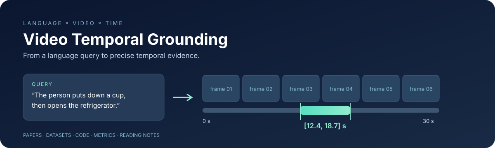

# Awesome Video Temporal Grounding

<p align="center">
  
</p>

[](scripts/validate.py)


**Video Temporal Grounding（VTG，视频时序定位）论文、数据集、代码与中文阅读总结。** 面向尽可能全面的 CCF A/B 会议和期刊覆盖，兼顾经典专用模型、视频大模型、强化学习、长视频、多片段和开放集任务。

参考 [showlab/awesome-gui-agent](https://github.com/showlab/awesome-gui-agent) 的导航、论文资源与贡献组织方式，独立整理 VTG 内容。欢迎通过 Issue / Pull Request 补充遗漏和修正发表信息，参见 [贡献指南](CONTRIBUTING.md)。

**快速导航**：[完整年份目录](papers/by-year.md) · [会议／期刊目录](papers/by-venue.md) · [方向目录](papers/by-topic.md) · [数据集](#数据集与评测资源) · [代表论文](#代表论文与方法总结) · [阅读路线](docs/reading-guide.md) · [补充论文](papers/supplementary.md) · [检索与覆盖说明](docs/coverage.md)

## 收录范围与统计

**主索引 419 条**：CCF A 278 条、CCF B 141 条；会议 294 条、期刊 125 条。另有 11 条补充记录；50 条主索引记录提供中文方法／资源摘要，92 条关联已核实的代码入口。

| 年份 | 条目 |
| --- | --- |
| [2026](papers/by-year.md#year-2026) | 80 |
| [2025](papers/by-year.md#year-2025) | 86 |
| [2024](papers/by-year.md#year-2024) | 71 |
| [2023](papers/by-year.md#year-2023) | 60 |
| [2022](papers/by-year.md#year-2022) | 45 |
| [2021](papers/by-year.md#year-2021) | 36 |
| [2020](papers/by-year.md#year-2020) | 21 |
| [2019](papers/by-year.md#year-2019) | 11 |
| [2018](papers/by-year.md#year-2018) | 5 |
| [2017](papers/by-year.md#year-2017) | 3 |
| [2013](papers/by-year.md#year-2013) | 1 |


**计数口径**：按独立发表记录计数，会议版与期刊扩展版可分别计入；同一版本的 arXiv 与正式论文合并。核心范围为语言查询的时间区间定位，同时收录相关数据集、综述、视频库检索、多区间及标注为扩展的时序证据问答。纯动作检测、纯空间定位和整段视频检索不系统收录。

**分级与核验**：使用 CCF **第七版（2026）**，不是历史发表年份的旧版分级。Findings、Workshop、Short、Demo、Doctoral Symposium、预印本和范围外会议独立保存。主索引中已发现的特殊出版类型已排除；仅有出版社主会议录元数据的条目，其 Full/Regular 类型尚未逐篇人工确认，见 `format_status` 字段与 [覆盖说明](docs/coverage.md)。

这是可持续增补的文献目录，**不宣称穷尽全部论文**。完整条目均保留原始会议录或出版社元数据来源；中文方法卡片基于摘要／原始介绍，其他标题标签用于导航，不代表逐篇全文评审。

## VTG 是什么

给定未剪辑视频与自然语言查询，定位查询对应的开始和结束时间。例如：“男子放下杯子后打开冰箱” → `[12.4, 18.7]` 秒。

常见名称包括 **TSGV、TVG、NLVL、VMR**。视频库场景还需要返回视频 ID；一个查询也可能对应多个区间，或者没有有效目标。任务边界与方法分类见 [任务定义与分类](docs/task-and-taxonomy.md)。

| 阶段 | 代表线索 | 阅读关注点 |
| --- | --- | --- |
| 2013–2018 | TACoS、CTRL、MCN、TMN | 语言与时间标注；候选匹配和组合关系 |
| 2019–2021 | SCDM、ExCL、2D-TAN、VSLNet、Moment-DETR | 跨模态交互、二维时间图、边界预测、集合预测 |
| 2022–2023 | UMT、MAD、CONE、QD-DETR、UniVTG | 统一任务、长视频、弱监督、去偏与泛化 |
| 2024–2025 | VTimeLLM、TimeChat、LITA、TRACE、Time-R1 | 时间表示、指令数据、长视频搜索、后训练 |
| 2026 | TimeLens、OmniVTG、MUSEG、TaRO、One-to-Many TG | 标注质量、语义覆盖、多区间与拒绝、推理奖励 |

## 数据集与评测资源

| 数据／资源 | 典型设置与特点 | 原始论文／官方资源 |
| --- | --- | --- |
| TACoS | 烹饪视频；细粒度动作与语言时间对齐；存在不同预处理版本 | [原始数据论文](https://aclanthology.org/Q13-1003/) · [数据主页](https://www.coli.uni-saarland.de/projects/smile/page.php?id=tacos) |
| Charades-STA | 室内活动；在 Charades 上增加句子时间标注 | [TALL / CTRL](https://github.com/jiyanggao/TALL) |
| DiDeMo | 用户视频中的可描述片段；离散区间和多标注协议 | [MCN / 数据](https://github.com/LisaAnne/LocalizingMoments) |
| ActivityNet Captions | 开放活动视频；原始任务为稠密事件描述，VTG 复用时间标注 | [原始论文](https://arxiv.org/abs/1705.00754) · [数据主页](https://cs.stanford.edu/people/ranjaykrishna/densevid/) |
| QVHighlights | 查询相关多片段及显著性；联合 Moment Retrieval / Highlight Detection | [Moment-DETR / 数据与 evaluator](https://github.com/jayleicn/moment_detr) |
| TVR / mTVR | 视频库片段检索；可结合字幕，多语言扩展 | [TVR / 官方实现](https://github.com/jayleicn/TVRetrieval) |
| MAD | 电影音频描述对齐；小时级视频与短时间目标 | [原始论文](https://arxiv.org/abs/2112.00431) · [官方项目](https://github.com/Soldelli/MAD) |
| Ego4D-NLQ | 第一视角经历中的自然语言证据定位 | [原始论文](https://arxiv.org/abs/2110.07058) · [NLQ benchmark](https://ego4d-data.org/docs/benchmarks/episodic-memory/) |
| E.T. Bench | 事件级、时间敏感、多任务视频理解 | [论文](https://arxiv.org/abs/2409.18111) |
| ActivityNet-RTL | 需要语义推理的时间定位，配合 LITA | [LITA / 资源](https://github.com/NVlabs/LITA) |
| TimeLens-Bench / 100K | 重标注评测与高质量训练数据；须与原版结果分开 | [论文与代码](https://github.com/TencentARC/TimeLens) |
| OmniVTG | 扩展常见与长尾语义覆盖的开放世界定位 | [论文与数据](https://github.com/oceanflowlab/OmniVTG) |
| 负查询／无目标设置 | 相关性判断与定位共同评测 | [Moment of Untruth](https://github.com/keflanagan/MomentofUntruth) · [Generalized VMR](https://proceedings.iclr.cc/paper_files/paper/2025/hash/7ac19fdcdf4f311f3e3ef2e7ef4784d7-Abstract-Conference.html) |

数据规模、划分和版本以原论文及当前数据文件为准；一个模型能够同时处理这些数据，并不意味着评测协议可直接合并。指标、输入条件和复现记录见 [评测指南](docs/evaluation.md)。

## 代表论文与方法总结

以下按阅读主题组织；不是性能排名。完整论文清单见 [按年份目录](papers/by-year.md)，包括较少在 Awesome 首页展示的期刊与其他 CCF A/B 会议工作。

### 综述与基准

- **[TACoS 原始数据论文](https://aclanthology.org/Q13-1003/)** · TACL 2013 · CCF B

  构建视频动作与多条语言描述及时间范围相联系的语料，是 TACoS 数据来源。它研究的动作语义相似性与后来的标准 VTG 设置并不完全相同。

  [Paper](https://aclanthology.org/Q13-1003/) · [索引记录](papers/by-year.md#primary_c50a828132a6)

- **[ActivityNet Captions](https://doi.org/10.1109/iccv.2017.83)** · ICCV 2017 · CCF A

  提出 dense video captioning 并提供事件描述及其时间边界。VTG 通常复用这些时间标注；它的原始任务与句子查询定位应区分。

  [Paper](https://doi.org/10.1109/iccv.2017.83) · [arXiv](https://arxiv.org/abs/1705.00754) · [索引记录](papers/by-year.md#doi_badf914d9142)

- **[Ego4D / NLQ](https://doi.org/10.1109/cvpr52688.2022.01842)** · CVPR 2022 · CCF A

  第一视角视频数据与任务集合，其中 NLQ 研究以自然语言找回个人经历中的时间证据。Ego4D 全部任务不等于 VTG，使用时指定 NLQ 划分。

  [Paper](https://doi.org/10.1109/cvpr52688.2022.01842) · [arXiv](https://arxiv.org/abs/2110.07058) · [索引记录](papers/by-year.md#doi_2f4103440335)

- **[MAD](https://openaccess.thecvf.com/content/CVPR2022/html/Soldan_MAD_A_Scalable_Dataset_for_Language_Grounding_in_Videos_From_CVPR_2022_paper.html)** · CVPR 2022 · CCF A

  利用电影音频描述形成长视频中的语言—片段对齐数据，把数秒级目标定位扩展到小时级电影。重点关注短目标与长上下文的不平衡。

  [Paper](https://openaccess.thecvf.com/content/CVPR2022/html/Soldan_MAD_A_Scalable_Dataset_for_Language_Grounding_in_Videos_From_CVPR_2022_paper.html) · [arXiv](https://arxiv.org/abs/2112.00431) · [Code](https://github.com/Soldelli/MAD) · [索引记录](papers/by-year.md#doi_fcc6704e9cc2)

- **[TSGV Survey](https://doi.org/10.1109/tpami.2023.3258628)** · TPAMI 2023 · CCF A

  从特征提取、跨模态交互到时间区间预测梳理传统 TSGV 方法，适合作为术语、机制分类和数据集问题的总入口。

  [Paper](https://doi.org/10.1109/tpami.2023.3258628) · [arXiv](https://arxiv.org/abs/2201.08071) · [索引记录](papers/by-year.md#doi_33c9ab87307f)

- **[E.T. Bench](https://doi.org/10.52202/079017-1009)** · NeurIPS 2024 · CCF A

  以开放式事件级和时间敏感任务补充仅评测整段视频问答的基准，覆盖定位与多事件理解，并提供 E.T. Chat 与指令数据。

  [Paper](https://doi.org/10.52202/079017-1009) · [arXiv](https://arxiv.org/abs/2409.18111) · [索引记录](papers/by-year.md#doi_efa07dec645b)

- **[VTG-MLLM Survey](https://doi.org/10.1109/tpami.2025.3615586)** · TPAMI 2026 · CCF A

  从大模型的功能角色、训练范式和视频特征处理三个维度整理 VTG-MLLM，并讨论数据集、评测协议和当前局限。

  [Paper](https://doi.org/10.1109/tpami.2025.3615586) · [arXiv](https://arxiv.org/abs/2508.10922) · [索引记录](papers/by-year.md#doi_5614a99b867f)

### 经典模型

- **[MCN / DiDeMo](https://openaccess.thecvf.com/content_iccv_2017/html/Hendricks_Localizing_Moments_in_ICCV_2017_paper.html)** · ICCV 2017 · CCF A

  通过局部片段与全视频上下文表示匹配自然语言查询，并构建 DiDeMo。适合对照连续边界回归与离散候选区间检索的差异。

  [Paper](https://openaccess.thecvf.com/content_iccv_2017/html/Hendricks_Localizing_Moments_in_ICCV_2017_paper.html) · [arXiv](https://arxiv.org/abs/1708.01641) · [Code](https://github.com/LisaAnne/LocalizingMoments) · [索引记录](papers/by-year.md#doi_e07c716f52fa)

- **[CTRL / TALL](https://openaccess.thecvf.com/content_iccv_2017/html/Gao_TALL_Temporal_Activity_ICCV_2017_paper.html)** · ICCV 2017 · CCF A

  把文本与滑窗候选片段联合编码，同时学习跨模态匹配分数和时间边界偏移。引入 Charades-STA，是理解候选匹配与边界回归路线的起点。

  [Paper](https://openaccess.thecvf.com/content_iccv_2017/html/Gao_TALL_Temporal_Activity_ICCV_2017_paper.html) · [arXiv](https://arxiv.org/abs/1705.02101) · [Code](https://github.com/jiyanggao/TALL) · [索引记录](papers/by-year.md#doi_354157c0d679)

- **[TMN](https://openaccess.thecvf.com/content_ECCV_2018/html/Bingbin_Liu_Temporal_Modular_Networks_ECCV_2018_paper.html)** · ECCV 2018 · CCF B

  根据自然语言的组合结构动态组装神经模块，处理复杂时序关系；在 DiDeMo 上研究组合式视频片段检索。

  [Paper](https://openaccess.thecvf.com/content_ECCV_2018/html/Bingbin_Liu_Temporal_Modular_Networks_ECCV_2018_paper.html) · [索引记录](papers/by-year.md#primary_e939aed64ac0)

- **[ExCL](https://aclanthology.org/N19-1198/)** · NAACL 2019 · CCF B

  以文本—视频联合表示直接预测起止帧，避免先生成候选再重排，提供抽取式时间边界定位的早期路线。

  [Paper](https://aclanthology.org/N19-1198/) · [索引记录](papers/by-year.md#primary_60e9bdde43d5)

- **[SCDM](https://proceedings.neurips.cc/paper_files/paper/2019/hash/6883966fd8f918a4aa29be29d2c386fb-Abstract.html)** · NeurIPS 2019 · CCF A

  以句子语义动态调节时序特征，增强语言与不同视频片段的对齐。会议版与同标题期刊版独立保留，并关联版本记录。

  [Paper](https://proceedings.neurips.cc/paper_files/paper/2019/hash/6883966fd8f918a4aa29be29d2c386fb-Abstract.html) · [Code](https://github.com/yytzsy/SCDM) · [索引记录](papers/by-year.md#primary_9a1cd0b12aa8)

- **[2D-TAN](https://doi.org/10.1609/aaai.v34i07.6984)** · AAAI 2020 · CCF A

  用起点、终点构成二维时间图，覆盖不同长度的候选并建模相邻区间关系。阅读时关注候选分辨率、二维卷积及其计算开销。

  [Paper](https://doi.org/10.1609/aaai.v34i07.6984) · [arXiv](https://arxiv.org/abs/1912.03590) · [Code](https://github.com/microsoft/2D-TAN) · [索引记录](papers/by-year.md#doi_bc3b93c6370f)

- **[VSLNet](https://doi.org/10.18653/v1/2020.acl-main.585)** · ACL 2020 · CCF A

  将视频定位转为类似抽取式阅读理解的 span prediction，利用查询引导的高亮区域辅助起止边界预测。适合研究 proposal-free 定位。

  [Paper](https://doi.org/10.18653/v1/2020.acl-main.585) · [arXiv](https://arxiv.org/abs/2004.13931) · [Code](https://github.com/IsaacChanghau/VSLNet) · [索引记录](papers/by-year.md#doi_c419a622dc06)

- **[SCDM](https://doi.org/10.1109/tpami.2020.3038993)** · TPAMI 2020 · CCF A

  以句子语义动态调节时序特征，增强语言与不同视频片段的对齐。会议版与同标题期刊版独立保留，并关联版本记录。

  [Paper](https://doi.org/10.1109/tpami.2020.3038993) · [Code](https://github.com/yytzsy/SCDM) · [索引记录](papers/by-year.md#doi_9230213407f8)

### 统一定位与高亮

- **[Moment-DETR / QVHighlights](https://proceedings.neurips.cc/paper_files/paper/2021/hash/62e0973455fd26eb03e91d5741a4a3bb-Abstract.html)** · NeurIPS 2021 · CCF A

  将片段检索视作集合预测，同时输出时间坐标与显著性分数。QVHighlights 提供查询相关片段和高亮标注，支持联合 MR/HD 评测。

  [Paper](https://proceedings.neurips.cc/paper_files/paper/2021/hash/62e0973455fd26eb03e91d5741a4a3bb-Abstract.html) · [arXiv](https://arxiv.org/abs/2107.09609) · [Code](https://github.com/jayleicn/moment_detr) · [索引记录](papers/by-year.md#primary_d255f23319b5)

- **[QD-DETR](https://openaccess.thecvf.com/content/CVPR2023/html/Moon_Query-Dependent_Video_Representation_for_Moment_Retrieval_and_Highlight_Detection_CVPR_2023_paper.html)** · CVPR 2023 · CCF A

  在视频编码阶段通过 cross-attention 注入查询信息，并使用不相关视频—查询对约束显著性预测。重点看 query-dependent representation 如何影响定位。

  [Paper](https://openaccess.thecvf.com/content/CVPR2023/html/Moon_Query-Dependent_Video_Representation_for_Moment_Retrieval_and_Highlight_Detection_CVPR_2023_paper.html) · [arXiv](https://arxiv.org/abs/2303.13874) · [Code](https://github.com/wjun0830/QD-DETR) · [索引记录](papers/by-year.md#doi_fc748bb19647)

- **[UniVTG](https://openaccess.thecvf.com/content/ICCV2023/html/Lin_UniVTG_Towards_Unified_Video-Language_Temporal_Grounding_ICCV_2023_paper.html)** · ICCV 2023 · CCF A

  将多种时间标注与定位任务统一建模，利用多样伪监督进行预训练。适合比较 moment retrieval、highlight detection 和视频摘要如何共享输出与损失。

  [Paper](https://openaccess.thecvf.com/content/ICCV2023/html/Lin_UniVTG_Towards_Unified_Video-Language_Temporal_Grounding_ICCV_2023_paper.html) · [arXiv](https://arxiv.org/abs/2307.16715) · [Code](https://github.com/showlab/UniVTG) · [索引记录](papers/by-year.md#doi_cabd4840f7fe)

- **[BAM-DETR](https://doi.org/10.1007/978-3-031-72627-9_13)** · ECCV 2024 · CCF B

  用区间内部锚点与左右边界替代中心—长度表示，分别优化全局锚点和边界细化。结合定位质量排序，研究边界歧义与候选选择。

  [Paper](https://doi.org/10.1007/978-3-031-72627-9_13) · [arXiv](https://arxiv.org/abs/2312.00083) · [Code](https://github.com/Pilhyeon/BAM-DETR) · [索引记录](papers/by-year.md#doi_f26f69bdc65d)

- **[CG-DETR](https://doi.org/10.1016/j.patcog.2025.112984)** · PR 2026 · CCF B

  通过含 dummy tokens 的自适应 cross-attention 和词—片段相关性校准，控制无关内容对查询表示的干扰，并预测片段高亮度。预印本与 PR 期刊标题不同，已合并链接。

  [Paper](https://doi.org/10.1016/j.patcog.2025.112984) · [arXiv](https://arxiv.org/abs/2311.08835) · [Code](https://github.com/wjun0830/CGDETR) · [索引记录](papers/by-year.md#doi_b713b5737e34)

### 多模态大模型

- **[SeViLA](https://proceedings.neurips.cc/paper_files/paper/2023/hash/f22a9af8dbb348952b08bd58d4734b50-Abstract-Conference.html)** · NeurIPS 2023 · CCF A

  通过 Localizer 找到与问题相关的关键帧，交给 Answerer 回答；反向利用 Answerer 的伪标签改进 Localizer。属于时序证据相关的问答扩展。

  [Paper](https://proceedings.neurips.cc/paper_files/paper/2023/hash/f22a9af8dbb348952b08bd58d4734b50-Abstract-Conference.html) · [Code](https://github.com/Yui010206/SeViLA) · [索引记录](papers/by-year.md#doi_a4ab5290307c)

- **[TimeChat](https://doi.org/10.1109/cvpr52733.2024.01357)** · CVPR 2024 · CCF A

  使用时间戳感知帧编码器和滑动视频 Q-Former，将视觉内容与时间绑定并适应不同视频长度；通过多任务指令数据提升时序理解。

  [Paper](https://doi.org/10.1109/cvpr52733.2024.01357) · [arXiv](https://arxiv.org/abs/2312.02051) · [Code](https://github.com/RenShuhuai-Andy/TimeChat) · [索引记录](papers/by-year.md#doi_0e8a9e6e6374)

- **[VTimeLLM](https://doi.org/10.1109/cvpr52733.2024.01353)** · CVPR 2024 · CCF A

  采用边界感知的三阶段训练，从图文对齐、多事件视频学习到指令调优，逐步建立视频内容与时间边界的联系。

  [Paper](https://doi.org/10.1109/cvpr52733.2024.01353) · [arXiv](https://arxiv.org/abs/2311.18445) · [Code](https://github.com/huangb23/VTimeLLM) · [索引记录](papers/by-year.md#doi_1c4a016e16bc)

- **[LITA](https://doi.org/10.1007/978-3-031-73039-9_12)** · ECCV 2024 · CCF B

  结合相对时间 tokens、SlowFast 视觉 tokens 和时序定位数据，提出推理时序定位 RTL 及 ActivityNet-RTL。阅读重点是时间表示与采样结构。

  [Paper](https://doi.org/10.1007/978-3-031-73039-9_12) · [arXiv](https://arxiv.org/abs/2403.19046) · [Code](https://github.com/NVlabs/LITA) · [索引记录](papers/by-year.md#doi_d1d10a770ec6)

- **[Momentor](https://proceedings.mlr.press/v235/qian24a.html)** · ICML 2024 · CCF A

  以自动数据引擎构建片段级视频指令数据 Moment-10M，训练模型进行细粒度时序理解、定位与片段级推理。

  [Paper](https://proceedings.mlr.press/v235/qian24a.html) · [arXiv](https://arxiv.org/abs/2402.11435) · [Code](https://github.com/DCDmllm/Momentor) · [索引记录](papers/by-year.md#primary_b7cc92f78e2e)

- **[VTG-LLM](https://doi.org/10.1609/aaai.v39i3.32341)** · AAAI 2025 · CCF A

  向视觉 tokens 注入时间戳知识，采用绝对时间 tokens 和 slot-based 压缩支持更多视频帧，并整理 VTG-IT-120K。正式会议版为 AAAI 2025。

  [Paper](https://doi.org/10.1609/aaai.v39i3.32341) · [arXiv](https://arxiv.org/abs/2405.13382) · [Code](https://github.com/gyxxyg/VTG-LLM) · [索引记录](papers/by-year.md#doi_256d8f509150)

- **[TRACE](https://proceedings.iclr.cc/paper_files/paper/2025/hash/df027cf11469e746ef94d583f9f5537f-Abstract-Conference.html)** · ICLR 2025 · CCF A

  把输出建模为由时间戳、显著性和文字描述组成的事件序列，利用事件间因果生成顺序及任务交错编码／解码统一 VTG 任务。

  [Paper](https://proceedings.iclr.cc/paper_files/paper/2025/hash/df027cf11469e746ef94d583f9f5537f-Abstract-Conference.html) · [arXiv](https://arxiv.org/abs/2410.05643) · [Code](https://github.com/gyxxyg/TRACE) · [索引记录](papers/by-year.md#primary_eac6302673a5)

- **[TimeSuite](https://proceedings.iclr.cc/paper_files/paper/2025/hash/5e8309c9ca683e11672e3dbcd4b87776-Abstract-Conference.html)** · ICLR 2025 · CCF A

  通过 token shuffling、Temporal Adaptive Position Encoding 和 grounding-centric 数据调优扩展长视频能力；以带时间戳的描述任务提供显式定位监督。

  [Paper](https://proceedings.iclr.cc/paper_files/paper/2025/hash/5e8309c9ca683e11672e3dbcd4b87776-Abstract-Conference.html) · [arXiv](https://arxiv.org/abs/2410.19702) · [Code](https://github.com/OpenGVLab/TimeSuite) · [索引记录](papers/by-year.md#primary_57ee770e1483)

- **[Divid](https://proceedings.iclr.cc/paper_files/paper/2026/hash/1c85c302ece39939c1b334c78f7ee1b8-Abstract-Conference.html)** · ICLR 2026 · CCF A

  在大模型中解耦空间与时间建模，用于具有时间证据的视频理解；同时涉及 VTG 和 grounded VideoQA。

  [Paper](https://proceedings.iclr.cc/paper_files/paper/2026/hash/1c85c302ece39939c1b334c78f7ee1b8-Abstract-Conference.html) · [索引记录](papers/by-year.md#primary_faaef62b9e0f)

### 长视频与训练自由

- **[TFVTG](https://doi.org/10.1007/978-3-031-73007-8_2)** · ECCV 2024 · CCF B

  利用 LLM 分解查询中的子事件与时序关系，借助预训练 VLM 对动态变化和静态状态评分，再按关系筛选、组合候选。无需目标任务训练。

  [Paper](https://doi.org/10.1007/978-3-031-73007-8_2) · [arXiv](https://arxiv.org/abs/2408.16219) · [索引记录](papers/by-year.md#doi_84d82a7fbda9)

- **[NumPro](https://openaccess.thecvf.com/content/CVPR2025/html/Wu_Number_it_Temporal_Grounding_Videos_like_Flipping_Manga_CVPR_2025_paper.html)** · CVPR 2025 · CCF A

  为视频帧添加可见的数字标识，使模型通过读取帧编号联系视觉证据与时间位置。论文分别讨论直接提示和进一步微调的设置。

  [Paper](https://openaccess.thecvf.com/content/CVPR2025/html/Wu_Number_it_Temporal_Grounding_Videos_like_Flipping_Manga_CVPR_2025_paper.html) · [arXiv](https://arxiv.org/abs/2411.10332) · [Code](https://github.com/yongliang-wu/NumPro) · [索引记录](papers/by-year.md#doi_00baa565b2c6)

- **[ReVisionLLM](https://openaccess.thecvf.com/content/CVPR2025/html/Hannan_ReVisionLLM_Recursive_Vision-Language_Model_for_Temporal_Grounding_in_Hour-Long_Videos_CVPR_2025_paper.html)** · CVPR 2025 · CCF A

  递归地从宽时间范围收缩到精确事件边界，并使用由短到长的分层训练策略处理小时级视频。关注多轮搜索的计算成本与误差传播。

  [Paper](https://openaccess.thecvf.com/content/CVPR2025/html/Hannan_ReVisionLLM_Recursive_Vision-Language_Model_for_Temporal_Grounding_in_Hour-Long_Videos_CVPR_2025_paper.html) · [arXiv](https://arxiv.org/abs/2411.14901) · [Code](https://github.com/Tanveer81/ReVisionLLM) · [索引记录](papers/by-year.md#doi_e6b3258078df)

- **[HiTeA](https://proceedings.iclr.cc/paper_files/paper/2026/hash/50e3c627697a456e29ec797c36621516-Abstract-Conference.html)** · ICLR 2026 · CCF A

  按事件、场景和动作层级组织训练自由的时间对齐，借助预训练视觉语言模型缩小长视频中的定位范围。

  [Paper](https://proceedings.iclr.cc/paper_files/paper/2026/hash/50e3c627697a456e29ec797c36621516-Abstract-Conference.html) · [索引记录](papers/by-year.md#primary_4b4847b5b231)

### 强化学习与新任务

- **[Generalized VMR](https://proceedings.iclr.cc/paper_files/paper/2025/hash/7ac19fdcdf4f311f3e3ef2e7ef4784d7-Abstract-Conference.html)** · ICLR 2025 · CCF A

  将没有目标和具有多个目标的查询纳入广义片段检索，提供 NExT-VMR 与 BCANet，考察传统单目标假设之外的预测行为。

  [Paper](https://proceedings.iclr.cc/paper_files/paper/2025/hash/7ac19fdcdf4f311f3e3ef2e7ef4784d7-Abstract-Conference.html) · [索引记录](papers/by-year.md#primary_8d63e1eead37)

- **[Time-R1](https://doi.org/10.52202/085713-2793)** · NeurIPS 2025 · CCF A

  以可验证奖励进行推理引导的强化学习后训练，结合适合 RL 的数据与训练策略，并提供 TVGBench。阅读时区分推理文本、定位奖励和数据选择各自的作用。

  [Paper](https://doi.org/10.52202/085713-2793) · [arXiv](https://arxiv.org/abs/2503.13377) · [Code](https://github.com/xiaomi-research/time-r1) · [索引记录](papers/by-year.md#doi_31bd832bbb7a)

- **[MUSEG](https://doi.org/10.18653/v1/2026.acl-long.1644)** · ACL 2026 · CCF A

  通过时间戳感知的多片段定位和分阶段奖励强化时序理解，使查询能关联多个相关区间。正式会议版为 ACL 2026。

  [Paper](https://doi.org/10.18653/v1/2026.acl-long.1644) · [arXiv](https://arxiv.org/abs/2505.20715) · [Code](https://github.com/THUNLP-MT/MUSEG) · [索引记录](papers/by-year.md#doi_7f2c68712055)

- **[CVA](https://openaccess.thecvf.com/content/CVPR2026/html/Moon_CVA_Context-aware_Video-text_Alignment_for_Video_Temporal_Grounding_CVPR_2026_paper.html)** · CVPR 2026 · CCF A

  将查询感知的背景多样化、上下文不变的边界区分损失和分层编码结合，缓解无关背景与困难负样本对视频—文本时序对齐的影响。

  [Paper](https://openaccess.thecvf.com/content/CVPR2026/html/Moon_CVA_Context-aware_Video-text_Alignment_for_Video_Temporal_Grounding_CVPR_2026_paper.html) · [arXiv](https://arxiv.org/abs/2603.24934) · [索引记录](papers/by-year.md#cvf_399cce74f290)

- **[HieraMamba](https://openaccess.thecvf.com/content/CVPR2026/html/An_HieraMamba_Video_Temporal_Grounding_via_Hierarchical_Anchor-Mamba_Pooling_CVPR_2026_paper.html)** · CVPR 2026 · CCF A

  通过分层 Anchor-Mamba Pooling 在多尺度保留视频时序结构，结合锚点条件和片段池化的对比目标平衡全局语义与局部细节。

  [Paper](https://openaccess.thecvf.com/content/CVPR2026/html/An_HieraMamba_Video_Temporal_Grounding_via_Hierarchical_Anchor-Mamba_Pooling_CVPR_2026_paper.html) · [arXiv](https://arxiv.org/abs/2510.23043) · [索引记录](papers/by-year.md#cvf_d003531f7d95)

- **[Learning to Refuse / RA-RFT](https://openaccess.thecvf.com/content/CVPR2026/html/Lee_Learning_to_Refuse_Refusal-Aware_Reinforcement_Fine-Tuning_for_Hard-Irrelevant_Queries_in_CVPR_2026_paper.html)** · CVPR 2026 · CCF A

  针对语义相近但实际无关的 hard-irrelevant 查询，联合格式、拒绝／IoU、解释与查询修正奖励进行训练，并构建 HI-VTG。

  [Paper](https://openaccess.thecvf.com/content/CVPR2026/html/Lee_Learning_to_Refuse_Refusal-Aware_Reinforcement_Fine-Tuning_for_Hard-Irrelevant_Queries_in_CVPR_2026_paper.html) · [arXiv](https://arxiv.org/abs/2511.23151) · [索引记录](papers/by-year.md#cvf_40c4ea75413f)

- **[OmniVTG](https://openaccess.thecvf.com/content/CVPR2026/html/Zheng_OmniVTG_A_Large-Scale_Dataset_and_Training_Paradigm_for_Open-World_Video_CVPR_2026_paper.html)** · CVPR 2026 · CCF A

  迭代补充数据中的语义覆盖缺口，通过以带时间描述为中心的数据引擎构建开放世界定位数据；结合先预测、再反思修正的训练流程。

  [Paper](https://openaccess.thecvf.com/content/CVPR2026/html/Zheng_OmniVTG_A_Large-Scale_Dataset_and_Training_Paradigm_for_Open-World_Video_CVPR_2026_paper.html) · [arXiv](https://arxiv.org/abs/2604.25276) · [Code](https://github.com/oceanflowlab/OmniVTG) · [索引记录](papers/by-year.md#cvf_4778f08e5fd5)

- **[T2SGrid](https://openaccess.thecvf.com/content/CVPR2026/html/Guo_T2SGrid_Temporal-to-Spatial_Gridification_for_Video_Temporal_Grounding_CVPR_2026_paper.html)** · CVPR 2026 · CCF A

  将滑窗内的连续视频帧排列成二维网格图像，以局部空间结构承载时间顺序，并用组合时间戳提供全局时间信息。

  [Paper](https://openaccess.thecvf.com/content/CVPR2026/html/Guo_T2SGrid_Temporal-to-Spatial_Gridification_for_Video_Temporal_Grounding_CVPR_2026_paper.html) · [arXiv](https://arxiv.org/abs/2603.06973) · [索引记录](papers/by-year.md#cvf_da5886c2cbde)

- **[TimeLens](https://openaccess.thecvf.com/content/CVPR2026/html/Zhang_TimeLens_Rethinking_Video_Temporal_Grounding_with_Multimodal_LLMs_CVPR_2026_paper.html)** · CVPR 2026 · CCF A

  系统研究标注质量与训练配方，构建重新标注的 TimeLens-Bench 与 TimeLens-100K，并探索时间表示和无需显式思考的 RLVR。比较结果时必须注明原版或重标注版。

  [Paper](https://openaccess.thecvf.com/content/CVPR2026/html/Zhang_TimeLens_Rethinking_Video_Temporal_Grounding_with_Multimodal_LLMs_CVPR_2026_paper.html) · [arXiv](https://arxiv.org/abs/2512.14698) · [Code](https://github.com/TencentARC/TimeLens) · [索引记录](papers/by-year.md#cvf_e85331dbe904)

- **[VideoITG](https://openaccess.thecvf.com/content/CVPR2026/html/Wang_VideoITG_Multimodal_Video_Understanding_with_Instructed_Temporal_Grounding_CVPR_2026_paper.html)** · CVPR 2026 · CCF A

  用 VidThinker 自动构造指令条件的时序定位标注，训练根据用户指令选择相关帧的模型，作为视频理解系统的采样模块。

  [Paper](https://openaccess.thecvf.com/content/CVPR2026/html/Wang_VideoITG_Multimodal_Video_Understanding_with_Instructed_Temporal_Grounding_CVPR_2026_paper.html) · [arXiv](https://arxiv.org/abs/2507.13353) · [Code](https://github.com/NVlabs/VideoITG) · [索引记录](papers/by-year.md#cvf_1a6d878f70a5)

- **[Invert4TVG](https://proceedings.iclr.cc/paper_files/paper/2026/hash/cba6f4460a1f395f68a88598c86e79bd-Abstract-Conference.html)** · ICLR 2026 · CCF A

  通过定位任务的逆向任务保持动作理解能力，研究增强时间定位时如何保留视频理解能力。

  [Paper](https://proceedings.iclr.cc/paper_files/paper/2026/hash/cba6f4460a1f395f68a88598c86e79bd-Abstract-Conference.html) · [索引记录](papers/by-year.md#primary_b50f7a33a512)

- **[CACR](https://proceedings.mlr.press/v306/qi26g.html)** · ICML 2026 · CCF A

  先选择候选视频片段，再结合时间逻辑推理、拒绝奖励与 GRPO 进行教学视频中的答案证据定位。

  [Paper](https://proceedings.mlr.press/v306/qi26g.html) · [索引记录](papers/by-year.md#primary_8e96aeba13dc)

- **[Foresee-to-Ground](https://proceedings.mlr.press/v306/zheng26l.html)** · ICML 2026 · CCF A

  先以边界敏感表示构造带明确时间范围的证据候选，再由 LLM 识别事件，分离事件辨识与边界测量以稳定预测。

  [Paper](https://proceedings.mlr.press/v306/zheng26l.html) · [Code](https://github.com/zelion2003/Foresee-to-Ground) · [索引记录](papers/by-year.md#primary_2691825887f9)

- **[TaRO](https://proceedings.mlr.press/v306/zheng26ad.html)** · ICML 2026 · CCF A

  用带时间戳的稠密描述构造时间感知推理，并以扰动事件边界后的推理概率变化设计 Temporal-Sensitivity Reward，逐步转向自由探索。

  [Paper](https://proceedings.mlr.press/v306/zheng26ad.html) · [Code](https://github.com/oceanflowlab/TaRO) · [索引记录](papers/by-year.md#primary_1650b210bb5e)

- **[One-to-Many TG](https://proceedings.mlr.press/v306/xu26cc.html)** · ICML 2026 · CCF A

  研究一个查询对应多个不连续片段的定位，提供任务、数据和集合评测指标，并设计时间与 caption 奖励。

  [Paper](https://proceedings.mlr.press/v306/xu26cc.html) · [索引记录](papers/by-year.md#primary_90119d6210b3)

- **[Video-OPD](https://proceedings.mlr.press/v306/li26im.html)** · ICML 2026 · CCF A

  用当前策略生成轨迹，再由教师提供 token 级反向 KL 蒸馏监督；结合教师验证的不一致样本课程提升 VTG 后训练效率。

  [Paper](https://proceedings.mlr.press/v306/li26im.html) · [索引记录](papers/by-year.md#primary_bdae96a5dcf3)

- **[VideoTemp-o3](https://proceedings.mlr.press/v306/liu26ej.html)** · ICML 2026 · CCF A

  联合建模时序定位与视频问答，支持按需裁剪和定位修正，并用专门的训练数据与奖励优化长视频工具推理。

  [Paper](https://proceedings.mlr.press/v306/liu26ej.html) · [索引记录](papers/by-year.md#primary_6fddfb776ac2)


## 补充与最新预印本

HawkEye、Grounded-VideoLLM、TimeRefine、Moment of Untruth，以及 TimePLE、EvoGround、UniversalVTG、TimeLens2 等保存于 [补充目录](papers/supplementary.md)。每条单独注明已核实的正式发表或预印本状态，避免将预印本误计为 CCF A/B 论文。

## 数据导出与维护

| 文件 | 用途 |
| --- | --- |
| [papers.json](data/papers.json) | 主索引、作者、发表信息、DOI、代码、方向、摘要与来源 |
| [papers.csv](papers/papers.csv) | 可直接导入表格或数据库 |
| [references.bib](papers/references.bib) | 全量引用条目，保留稳定记录 ID |
| [supplementary.json](data/supplementary.json) | 范围外论文、特殊出版类型与预印本 |
| [venues.json](data/venues.json) | 使用的 CCF 第七版会议／期刊分级 |
| [stats.json](data/stats.json) | 与主索引同步生成的统计 |
| [数据字段说明](docs/data-schema.md) | 字段含义、年份口径、核验层次与版本关系 |

```bash
python3 scripts/build_catalog.py
python3 scripts/validate.py
python3 scripts/build_catalog.py --check
```

脚本仅依赖 Python 3.9+ 标准库，检查元数据、内部链接和生成文件的一致性。修改数据后重新生成目录即可。

[GitHub Actions 配置模板](scripts/github-actions.example.yml) 可复制到 `.github/workflows/validate.yml` 后启用自动检查。本次上传凭据缺少 `workflow` 权限，因此以普通文件保存该模板，本地校验已通过。

## 来源与致谢

内容结构参考 [Awesome GUI Agent](https://github.com/showlab/awesome-gui-agent)。文献发现参考 [Soldelli/Awesome-Temporal-Language-Grounding-in-Videos](https://github.com/Soldelli/Awesome-Temporal-Language-Grounding-in-Videos)、[Tangkfan/Awesome-Temporal-Video-Grounding](https://github.com/Tangkfan/Awesome-Temporal-Video-Grounding)、[iLearn-Lab/TPAMI26-Awesome-MLLMs-for-Video-Temporal-Grounding](https://github.com/iLearn-Lab/TPAMI26-Awesome-MLLMs-for-Video-Temporal-Grounding) 和 [NeverMoreLCH/Awesome-Video-Grounding](https://github.com/NeverMoreLCH/Awesome-Video-Grounding)。

发表记录优先依据 CVF、ACL Anthology、PMLR、ICLR／NeurIPS 官方会议录以及出版社提交的 Crossref 元数据；第三方 Awesome 标签不能单独证明录用。CCF 分级依据 [CCF 目录入口](https://www.ccf.org.cn/Academic_Evaluation/By_category/) 与 [第七版正式目录 PDF（丽水学院科研处镜像）](https://kyc.lsu.edu.cn/_upload/article/files/20/77/2cbaa3754eb9aff9ed74cafed8ff/23a8de02-594c-445f-b084-69b0193c05b3.pdf)。

中文摘要和示意图为本仓库独立整理；论文、代码、数据集的权利与使用条款由各自来源决定。本仓库提供索引与链接，不分发论文 PDF 或数据集副本。
