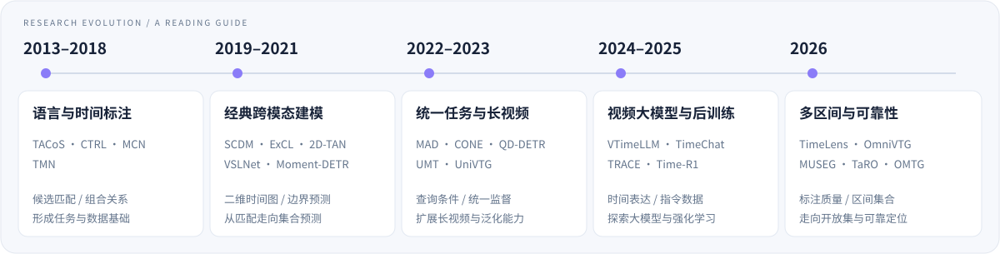

<div align="center">

# Awesome Video Temporal Grounding

**视频时序定位 · 论文、方法、数据与评测**

A research collection for grounding language in video time.

[](data/venues.json) [](docs/coverage.md) [](docs/coverage.md) [](CONTRIBUTING.md)

**[完整论文目录](papers/by-year.md)** &nbsp; · &nbsp; **[方法摘要](#selected-papers)** &nbsp; · &nbsp; **[数据集](#datasets)** &nbsp; · &nbsp; **[阅读路线](#reading-guide)**


<sub>CCF A 278 · CCF B 141 &nbsp; / &nbsp; 会议 294 · 期刊 125 &nbsp; / &nbsp; 补充 11 条</sub>

</div>

<br>

> **找到论文，也理解方法。** 这里整理语言查询的视频时间区间定位研究，连接经典专用模型、视频大模型、训练自由方法与强化学习，并提供可追溯的论文来源、中文摘要和代码入口。
>
> 按 **CCF 第七版（2026）** 统一标注。以独立发表记录计数，会议版与期刊版可分别保留；预印本及特殊出版类型单列。覆盖范围与核验程度见 [检索说明](docs/coverage.md)。

<a id="explore"></a>

## 🧭 从这里开始

<table>
<tr>
<td width="33%" valign="top">
<h3>📚 浏览论文</h3>
<p>从年份、会议与期刊找到目标工作。</p>
<p><a href="papers/by-year.md"><strong>按年份 →</strong></a><br><a href="papers/by-venue.md">按会议 / 期刊</a> · <a href="papers/by-topic.md">按研究方向</a></p>
</td>
<td width="33%" valign="top">
<h3>🧠 理解方法</h3>
<p>从中文摘要进入模型机制与原始论文。</p>
<p><a href="#selected-papers"><strong>代表论文 →</strong></a><br><a href="docs/task-and-taxonomy.md">任务定义与分类</a> · <a href="docs/reading-guide.md">专题阅读</a></p>
</td>
<td width="33%" valign="top">
<h3>🧪 准备实验</h3>
<p>明确数据版本、输入条件和评测指标。</p>
<p><a href="#datasets"><strong>数据集与基准 →</strong></a><br><a href="docs/evaluation.md">评测与复现指南</a></p>
</td>
</tr>
<tr>
<td width="33%" valign="top">
<h3>🗂️ 获取数据</h3>
<p>导出文献记录，连接个人研究工作流。</p>
<p><a href="papers/references.bib"><strong>BibTeX →</strong></a><br><a href="papers/papers.csv">CSV</a> · <a href="data/papers.json">JSON</a> · <a href="docs/data-schema.md">字段说明</a></p>
</td>
<td width="33%" valign="top">
<h3>🌱 探索补充</h3>
<p>查看预印本、Findings 与范围外资源。</p>
<p><a href="papers/supplementary.md"><strong>补充目录 →</strong></a><br>每条分别注明发表状态与收录原因。</p>
</td>
<td width="33%" valign="top">
<h3>🤝 一起维护</h3>
<p>补充遗漏、纠正元数据、完善阅读摘要。</p>
<p><a href="CONTRIBUTING.md"><strong>贡献指南 →</strong></a><br><a href="https://github.com/AdjacentGarden/VTG_repo_summary/issues">提交 Issue</a> · <a href="https://github.com/AdjacentGarden/VTG_repo_summary/pulls">Pull Requests</a></p>
</td>
</tr>
</table>

### 论文索引速览

| **[2026](papers/by-year.md#year-2026)** | **[2025](papers/by-year.md#year-2025)** | **[2024](papers/by-year.md#year-2024)** | **[2023](papers/by-year.md#year-2023)** | **[2022](papers/by-year.md#year-2022)** | **[2021](papers/by-year.md#year-2021)** | **[2020](papers/by-year.md#year-2020)** | **[2019](papers/by-year.md#year-2019)** | **[2018](papers/by-year.md#year-2018)** | **[2017](papers/by-year.md#year-2017)** | **[2013](papers/by-year.md#year-2013)** |
| :---: | :---: | :---: | :---: | :---: | :---: | :---: | :---: | :---: | :---: | :---: |
| 80 | 86 | 71 | 60 | 45 | 36 | 21 | 11 | 5 | 3 | 1 |


<details>
<summary><strong>查看会议与期刊覆盖、统计口径</strong></summary>

| 范围 | Venue（按 CCF 第七版） |
| --- | --- |
| 会议 · CCF A | AAAI · ACL · ACM MM · CVPR · ICCV · ICLR · ICML · NeurIPS · SIGIR |
| 会议 · CCF B | CIKM · COLING · DASFAA · ECCV · EMNLP · ICASSP · ICME · ICMR · IJCAI · MICCAI · NAACL |
| 期刊 · CCF A | IJCV · TIP · TMM · TOIS · TPAMI |
| 期刊 · CCF B | CVIU · IPM · Information Sciences · Neural Networks · PR · TACL · TCSVT · TITS · TNNLS · TOMM |


- **版本**：同一发表版本的 arXiv 与正式论文合并；会议版和期刊扩展版可分别计入，因此记录数量不等于独立算法数量。
- **范围**：包括 VTG 核心方法、视频库检索、多区间、相关数据与综述；时序证据问答单独标注。
- **出版类型**：已发现的 Findings、Workshop、Short、Demo、Doctoral Symposium 等移入补充。仅有主会议录元数据的部分记录，尚未逐篇核实 Full/Regular 类型，见 `format_status`。
- **核验**：中文卡片依据摘要／原始介绍；其余方向标签主要由标题推断。代码入口经对应关系核对，未逐个运行复现。

[完整统计](data/stats.json) · [来源与覆盖缺口](docs/coverage.md)

</details>

<br>

<a id="research-landscape"></a>

## 🎬 任务与研究脉络

**给定视频与自然语言，找到描述发生的时间。** 例如，“男子放下杯子后打开冰箱”对应 `[12.4, 18.7]` 秒。模型需要理解内容、事件之间的关系，以及完整事件的时间边界。

常见名称包括 **TSGV · TVG · NLVL · VMR**。它们的具体任务设置可能不同，阅读时以原论文定义为准。

| 单视频定位 | 视频库片段检索 | 多区间与无目标 | 时序证据问答 |
| :--- | :--- | :--- | :--- |
| 视频＋句子 → 起止时间 | 视频库＋句子 → 视频 ID＋区间 | 输出多个区间，或拒绝无关查询 | 回答问题，并定位支持答案的证据 |



### 从机制出发，选择研究方向

| 研究方向 | 核心问题 | 阅读线索 |
| --- | --- | --- |
| **候选区间与边界建模** | 用候选匹配、二维时间图还是直接预测边界？ | CTRL → 2D-TAN / VSLNet → BAM-DETR |
| **统一定位与高亮** | 查询如何进入视频表示？不同时间标注如何共享模型？ | Moment-DETR → QD-DETR → UniVTG |
| **弱监督与低标注** | 缺少完整边界时，怎样构造有效监督？ | SCN → 点监督 / D3G → 弱监督大模型 |
| **泛化与去偏** | 模型是否依赖位置、长度、语言共现等捷径？ | Interventional Video Grounding → 组合泛化 / OOD |
| **长视频与在线定位** | 有限计算预算内，怎样找回少量时间证据？ | CONE → SnAG → ReVisionLLM → HieraMamba |
| **视频大模型与后训练** | 视觉、时间表达、指令数据与奖励怎样协同？ | VTimeLLM / TimeChat → TRACE → Time-R1 / TimeLens |
| **开放集与多片段** | 目标不存在或不止一个时，怎样预测与评测？ | Generalized VMR → Learning to Refuse → MUSEG / One-to-Many TG |

[查看完整分类 →](docs/task-and-taxonomy.md) &nbsp; · &nbsp; [按研究方向检索论文 →](papers/by-topic.md)

<br>

<a id="datasets"></a>

## 🗃️ 数据集与评测资源

### 基础数据、长视频与新任务

| 数据集 / 基准 | 场景与任务 | 论文 / 官方资源 |
| --- | --- | --- |
| TACoS | 烹饪视频；细粒度动作与语言时间对齐；存在不同预处理版本 | [原始数据论文](https://aclanthology.org/Q13-1003/) · [数据主页](https://www.coli.uni-saarland.de/projects/smile/page.php?id=tacos) |
| Charades-STA | 室内活动；在 Charades 上增加句子时间标注 | [TALL / CTRL](https://github.com/jiyanggao/TALL) |
| DiDeMo | 用户视频中的可描述片段；离散区间和多标注协议 | [MCN / 数据](https://github.com/LisaAnne/LocalizingMoments) |
| ActivityNet Captions | 开放活动视频；原始任务为稠密事件描述，VTG 复用时间标注 | [原始论文](https://arxiv.org/abs/1705.00754) · [数据主页](https://cs.stanford.edu/people/ranjaykrishna/densevid/) |
| QVHighlights | 查询相关多片段及显著性；联合 Moment Retrieval / Highlight Detection | [Moment-DETR / 数据与 evaluator](https://github.com/jayleicn/moment_detr) |
| TVR / mTVR | 视频库片段检索；可结合字幕，多语言扩展 | [TVR / 官方实现](https://github.com/jayleicn/TVRetrieval) |
| MAD | 电影音频描述对齐；小时级视频与短时间目标 | [原始论文](https://arxiv.org/abs/2112.00431) · [官方项目](https://github.com/Soldelli/MAD) |
| Ego4D-NLQ | 第一视角经历中的自然语言证据定位 | [原始论文](https://arxiv.org/abs/2110.07058) · [NLQ benchmark](https://ego4d-data.org/docs/benchmarks/episodic-memory/) |
| E.T. Bench | 事件级、时间敏感、多任务视频理解 | [论文](https://arxiv.org/abs/2409.18111) |
| ActivityNet-RTL | 需要语义推理的时间定位，配合 LITA | [LITA / 资源](https://github.com/NVlabs/LITA) |
| TimeLens-Bench / 100K | 重标注评测与高质量训练数据；须与原版结果分开 | [论文与代码](https://github.com/TencentARC/TimeLens) |
| OmniVTG | 扩展常见与长尾语义覆盖的开放世界定位 | [论文与数据](https://github.com/oceanflowlab/OmniVTG) |
| 负查询／无目标设置 | 相关性判断与定位共同评测 | [Moment of Untruth](https://github.com/keflanagan/MomentofUntruth) · [Generalized VMR](https://proceedings.iclr.cc/paper_files/paper/2025/hash/7ac19fdcdf4f311f3e3ef2e7ef4784d7-Abstract-Conference.html) |


> **先确定版本，再比较结果。** 数据规模和划分以原始资源为准。Legacy 与 TimeLens-Bench、单视频与视频库、单区间与多区间设置应分别记录，不能只凭相同指标名称直接比较。

### 评测速查

| 设置 | 常见指标 | 比较时至少确认 |
| --- | --- | --- |
| 单视频时间定位 | R@K@IoU、mIoU | K、IoU 阈值、split、多标注处理 |
| 联合片段检索 / 高亮 | MR mAP、HD mAP、HIT@1 | MR 与 HD 分开报告，注明匹配与显著性协议 |
| 视频库片段检索 | VCMR Recall | 检索库大小、视频匹配与时间匹配 |
| 多区间 / 负查询 | 集合匹配、定位与相关性指标 | 区间数量、匹配规则、拒绝阈值与负例构造 |

[指标定义、输入条件与复现注意事项 →](docs/evaluation.md)

<br>

<a id="selected-papers"></a>
<a id="代表论文与方法总结"></a>

## 🧠 代表论文与方法总结

**50 条中文方法／资源摘要，按六个阅读主题组织。** 点击主题展开论文；方法名链接到原论文，资源列提供预印本、代码与完整索引。以下是阅读组织方式，不是性能排名。

<details>
<summary><strong>01 · 综述与基准</strong> &nbsp; <sub>7 条摘要</sub></summary>

先建立术语、任务边界与数据来源的全景。

| 论文 / 发表 | 核心思路与阅读关注点 | 资源 |
| --- | --- | --- |
| <a href="https://aclanthology.org/Q13-1003/" title="Grounding Action Descriptions in Videos"><strong>TACoS 原始数据论文</strong></a><br><sub>TACL&nbsp;2013&nbsp;·&nbsp;CCF&nbsp;B</sub> | 构建视频动作与多条语言描述及时间范围相联系的语料，是 TACoS 数据来源。它研究的动作语义相似性与后来的标准 VTG 设置并不完全相同。 | [记录](papers/by-year.md#primary_c50a828132a6) |
| <a href="https://doi.org/10.1109/iccv.2017.83" title="Dense-Captioning Events in Videos"><strong>ActivityNet Captions</strong></a><br><sub>ICCV&nbsp;2017&nbsp;·&nbsp;CCF&nbsp;A</sub> | 提出 dense video captioning 并提供事件描述及其时间边界。VTG 通常复用这些时间标注；它的原始任务与句子查询定位应区分。 | [arXiv](https://arxiv.org/abs/1705.00754)<br>[记录](papers/by-year.md#doi_badf914d9142) |
| <a href="https://doi.org/10.1109/cvpr52688.2022.01842" title="Ego4D: Around the World in 3,000 Hours of Egocentric Video"><strong>Ego4D / NLQ</strong></a><br><sub>CVPR&nbsp;2022&nbsp;·&nbsp;CCF&nbsp;A</sub> | 第一视角视频数据与任务集合，其中 NLQ 研究以自然语言找回个人经历中的时间证据。Ego4D 全部任务不等于 VTG，使用时指定 NLQ 划分。 | [arXiv](https://arxiv.org/abs/2110.07058)<br>[记录](papers/by-year.md#doi_2f4103440335) |
| <a href="https://openaccess.thecvf.com/content/CVPR2022/html/Soldan_MAD_A_Scalable_Dataset_for_Language_Grounding_in_Videos_From_CVPR_2022_paper.html" title="MAD: A Scalable Dataset for Language Grounding in Videos from Movie Audio Descriptions"><strong>MAD</strong></a><br><sub>CVPR&nbsp;2022&nbsp;·&nbsp;CCF&nbsp;A</sub> | 利用电影音频描述形成长视频中的语言—片段对齐数据，把数秒级目标定位扩展到小时级电影。重点关注短目标与长上下文的不平衡。 | [arXiv](https://arxiv.org/abs/2112.00431)<br>[Code](https://github.com/Soldelli/MAD)<br>[记录](papers/by-year.md#doi_fcc6704e9cc2) |
| <a href="https://doi.org/10.1109/tpami.2023.3258628" title="Temporal Sentence Grounding in Videos: A Survey and Future Directions"><strong>TSGV Survey</strong></a><br><sub>TPAMI&nbsp;2023&nbsp;·&nbsp;CCF&nbsp;A</sub> | 从特征提取、跨模态交互到时间区间预测梳理传统 TSGV 方法，适合作为术语、机制分类和数据集问题的总入口。 | [arXiv](https://arxiv.org/abs/2201.08071)<br>[记录](papers/by-year.md#doi_33c9ab87307f) |
| <a href="https://doi.org/10.52202/079017-1009" title="E.T. Bench: Towards Open-Ended Event-Level Video-Language Understanding"><strong>E.T. Bench</strong></a><br><sub>NeurIPS&nbsp;2024&nbsp;·&nbsp;CCF&nbsp;A</sub> | 以开放式事件级和时间敏感任务补充仅评测整段视频问答的基准，覆盖定位与多事件理解，并提供 E.T. Chat 与指令数据。 | [arXiv](https://arxiv.org/abs/2409.18111)<br>[记录](papers/by-year.md#doi_efa07dec645b) |
| <a href="https://doi.org/10.1109/tpami.2025.3615586" title="A Survey on Video Temporal Grounding With Multimodal Large Language Model"><strong>VTG-MLLM Survey</strong></a><br><sub>TPAMI&nbsp;2026&nbsp;·&nbsp;CCF&nbsp;A</sub> | 从大模型的功能角色、训练范式和视频特征处理三个维度整理 VTG-MLLM，并讨论数据集、评测协议和当前局限。 | [arXiv](https://arxiv.org/abs/2508.10922)<br>[记录](papers/by-year.md#doi_5614a99b867f) |

</details>

<details open>
<summary><strong>02 · 经典模型</strong> &nbsp; <sub>8 条摘要</sub></summary>

从候选片段、组合推理到二维时间图与直接边界预测。

| 论文 / 发表 | 核心思路与阅读关注点 | 资源 |
| --- | --- | --- |
| <a href="https://openaccess.thecvf.com/content_iccv_2017/html/Hendricks_Localizing_Moments_in_ICCV_2017_paper.html" title="Localizing Moments in Video with Natural Language"><strong>MCN / DiDeMo</strong></a><br><sub>ICCV&nbsp;2017&nbsp;·&nbsp;CCF&nbsp;A</sub> | 通过局部片段与全视频上下文表示匹配自然语言查询，并构建 DiDeMo。适合对照连续边界回归与离散候选区间检索的差异。 | [arXiv](https://arxiv.org/abs/1708.01641)<br>[Code](https://github.com/LisaAnne/LocalizingMoments)<br>[记录](papers/by-year.md#doi_e07c716f52fa) |
| <a href="https://openaccess.thecvf.com/content_iccv_2017/html/Gao_TALL_Temporal_Activity_ICCV_2017_paper.html" title="TALL: Temporal Activity Localization via Language Query"><strong>CTRL / TALL</strong></a><br><sub>ICCV&nbsp;2017&nbsp;·&nbsp;CCF&nbsp;A</sub> | 把文本与滑窗候选片段联合编码，同时学习跨模态匹配分数和时间边界偏移。引入 Charades-STA，是理解候选匹配与边界回归路线的起点。 | [arXiv](https://arxiv.org/abs/1705.02101)<br>[Code](https://github.com/jiyanggao/TALL)<br>[记录](papers/by-year.md#doi_354157c0d679) |
| <a href="https://openaccess.thecvf.com/content_ECCV_2018/html/Bingbin_Liu_Temporal_Modular_Networks_ECCV_2018_paper.html" title="Temporal Modular Networks for Retrieving Complex Compositional Activities in Videos"><strong>TMN</strong></a><br><sub>ECCV&nbsp;2018&nbsp;·&nbsp;CCF&nbsp;B</sub> | 根据自然语言的组合结构动态组装神经模块，处理复杂时序关系；在 DiDeMo 上研究组合式视频片段检索。 | [记录](papers/by-year.md#primary_e939aed64ac0) |
| <a href="https://aclanthology.org/N19-1198/" title="ExCL: Extractive Clip Localization Using Natural Language Descriptions"><strong>ExCL</strong></a><br><sub>NAACL&nbsp;2019&nbsp;·&nbsp;CCF&nbsp;B</sub> | 以文本—视频联合表示直接预测起止帧，避免先生成候选再重排，提供抽取式时间边界定位的早期路线。 | [记录](papers/by-year.md#primary_60e9bdde43d5) |
| <a href="https://proceedings.neurips.cc/paper_files/paper/2019/hash/6883966fd8f918a4aa29be29d2c386fb-Abstract.html" title="Semantic Conditioned Dynamic Modulation for Temporal Sentence Grounding in Videos"><strong>SCDM</strong></a><br><sub>NeurIPS&nbsp;2019&nbsp;·&nbsp;CCF&nbsp;A</sub> | 以句子语义动态调节时序特征，增强语言与不同视频片段的对齐。会议版与同标题期刊版独立保留，并关联版本记录。 | [Code](https://github.com/yytzsy/SCDM)<br>[记录](papers/by-year.md#primary_9a1cd0b12aa8) |
| <a href="https://doi.org/10.1609/aaai.v34i07.6984" title="Learning 2D Temporal Adjacent Networks for Moment Localization with Natural Language"><strong>2D-TAN</strong></a><br><sub>AAAI&nbsp;2020&nbsp;·&nbsp;CCF&nbsp;A</sub> | 用起点、终点构成二维时间图，覆盖不同长度的候选并建模相邻区间关系。阅读时关注候选分辨率、二维卷积及其计算开销。 | [arXiv](https://arxiv.org/abs/1912.03590)<br>[Code](https://github.com/microsoft/2D-TAN)<br>[记录](papers/by-year.md#doi_bc3b93c6370f) |
| <a href="https://doi.org/10.18653/v1/2020.acl-main.585" title="Span-based Localizing Network for Natural Language Video Localization"><strong>VSLNet</strong></a><br><sub>ACL&nbsp;2020&nbsp;·&nbsp;CCF&nbsp;A</sub> | 将视频定位转为类似抽取式阅读理解的 span prediction，利用查询引导的高亮区域辅助起止边界预测。适合研究 proposal-free 定位。 | [arXiv](https://arxiv.org/abs/2004.13931)<br>[Code](https://github.com/IsaacChanghau/VSLNet)<br>[记录](papers/by-year.md#doi_c419a622dc06) |
| <a href="https://doi.org/10.1109/tpami.2020.3038993" title="Semantic Conditioned Dynamic Modulation for Temporal Sentence Grounding in Videos"><strong>SCDM</strong></a><br><sub>TPAMI&nbsp;2020&nbsp;·&nbsp;CCF&nbsp;A</sub> | 以句子语义动态调节时序特征，增强语言与不同视频片段的对齐。会议版与同标题期刊版独立保留，并关联版本记录。 | [Code](https://github.com/yytzsy/SCDM)<br>[记录](papers/by-year.md#doi_9230213407f8) |

</details>

<details open>
<summary><strong>03 · 统一定位与高亮</strong> &nbsp; <sub>5 条摘要</sub></summary>

关注 query conditioning、统一标注和定位边界表示。

| 论文 / 发表 | 核心思路与阅读关注点 | 资源 |
| --- | --- | --- |
| <a href="https://proceedings.neurips.cc/paper_files/paper/2021/hash/62e0973455fd26eb03e91d5741a4a3bb-Abstract.html" title="Detecting Moments and Highlights in Videos via Natural Language Queries"><strong>Moment-DETR / QVHighlights</strong></a><br><sub>NeurIPS&nbsp;2021&nbsp;·&nbsp;CCF&nbsp;A</sub> | 将片段检索视作集合预测，同时输出时间坐标与显著性分数。QVHighlights 提供查询相关片段和高亮标注，支持联合 MR/HD 评测。 | [arXiv](https://arxiv.org/abs/2107.09609)<br>[Code](https://github.com/jayleicn/moment_detr)<br>[记录](papers/by-year.md#primary_d255f23319b5) |
| <a href="https://openaccess.thecvf.com/content/CVPR2023/html/Moon_Query-Dependent_Video_Representation_for_Moment_Retrieval_and_Highlight_Detection_CVPR_2023_paper.html" title="Query - Dependent Video Representation for Moment Retrieval and Highlight Detection"><strong>QD-DETR</strong></a><br><sub>CVPR&nbsp;2023&nbsp;·&nbsp;CCF&nbsp;A</sub> | 在视频编码阶段通过 cross-attention 注入查询信息，并使用不相关视频—查询对约束显著性预测。重点看 query-dependent representation 如何影响定位。 | [arXiv](https://arxiv.org/abs/2303.13874)<br>[Code](https://github.com/wjun0830/QD-DETR)<br>[记录](papers/by-year.md#doi_fc748bb19647) |
| <a href="https://openaccess.thecvf.com/content/ICCV2023/html/Lin_UniVTG_Towards_Unified_Video-Language_Temporal_Grounding_ICCV_2023_paper.html" title="UniVTG: Towards Unified Video-Language Temporal Grounding"><strong>UniVTG</strong></a><br><sub>ICCV&nbsp;2023&nbsp;·&nbsp;CCF&nbsp;A</sub> | 将多种时间标注与定位任务统一建模，利用多样伪监督进行预训练。适合比较 moment retrieval、highlight detection 和视频摘要如何共享输出与损失。 | [arXiv](https://arxiv.org/abs/2307.16715)<br>[Code](https://github.com/showlab/UniVTG)<br>[记录](papers/by-year.md#doi_cabd4840f7fe) |
| <a href="https://doi.org/10.1007/978-3-031-72627-9_13" title="BAM-DETR: Boundary-Aligned Moment Detection Transformer for Temporal Sentence Grounding in Videos"><strong>BAM-DETR</strong></a><br><sub>ECCV&nbsp;2024&nbsp;·&nbsp;CCF&nbsp;B</sub> | 用区间内部锚点与左右边界替代中心—长度表示，分别优化全局锚点和边界细化。结合定位质量排序，研究边界歧义与候选选择。 | [arXiv](https://arxiv.org/abs/2312.00083)<br>[Code](https://github.com/Pilhyeon/BAM-DETR)<br>[记录](papers/by-year.md#doi_f26f69bdc65d) |
| <a href="https://doi.org/10.1016/j.patcog.2025.112984" title="Correlation-guided calibration of query dependency for video temporal grounding"><strong>CG-DETR</strong></a><br><sub>PR&nbsp;2026&nbsp;·&nbsp;CCF&nbsp;B</sub> | 通过含 dummy tokens 的自适应 cross-attention 和词—片段相关性校准，控制无关内容对查询表示的干扰，并预测片段高亮度。预印本与 PR 期刊标题不同，已合并链接。 | [arXiv](https://arxiv.org/abs/2311.08835)<br>[Code](https://github.com/wjun0830/CGDETR)<br>[记录](papers/by-year.md#doi_b713b5737e34) |

</details>

<details>
<summary><strong>04 · 多模态大模型</strong> &nbsp; <sub>9 条摘要</sub></summary>

理解视频表示、时间编码、指令数据和事件生成。

| 论文 / 发表 | 核心思路与阅读关注点 | 资源 |
| --- | --- | --- |
| <a href="https://proceedings.neurips.cc/paper_files/paper/2023/hash/f22a9af8dbb348952b08bd58d4734b50-Abstract-Conference.html" title="Self-Chained Image-Language Model for Video Localization and Question Answering"><strong>SeViLA</strong></a><br><sub>NeurIPS&nbsp;2023&nbsp;·&nbsp;CCF&nbsp;A</sub> | 通过 Localizer 找到与问题相关的关键帧，交给 Answerer 回答；反向利用 Answerer 的伪标签改进 Localizer。属于时序证据相关的问答扩展。 | [Code](https://github.com/Yui010206/SeViLA)<br>[记录](papers/by-year.md#doi_a4ab5290307c) |
| <a href="https://doi.org/10.1109/cvpr52733.2024.01357" title="TimeChat: A Time-sensitive Multimodal Large Language Model for Long Video Understanding"><strong>TimeChat</strong></a><br><sub>CVPR&nbsp;2024&nbsp;·&nbsp;CCF&nbsp;A</sub> | 使用时间戳感知帧编码器和滑动视频 Q-Former，将视觉内容与时间绑定并适应不同视频长度；通过多任务指令数据提升时序理解。 | [arXiv](https://arxiv.org/abs/2312.02051)<br>[Code](https://github.com/RenShuhuai-Andy/TimeChat)<br>[记录](papers/by-year.md#doi_0e8a9e6e6374) |
| <a href="https://doi.org/10.1109/cvpr52733.2024.01353" title="VTimeLLM: Empower LLM to Grasp Video Moments"><strong>VTimeLLM</strong></a><br><sub>CVPR&nbsp;2024&nbsp;·&nbsp;CCF&nbsp;A</sub> | 采用边界感知的三阶段训练，从图文对齐、多事件视频学习到指令调优，逐步建立视频内容与时间边界的联系。 | [arXiv](https://arxiv.org/abs/2311.18445)<br>[Code](https://github.com/huangb23/VTimeLLM)<br>[记录](papers/by-year.md#doi_1c4a016e16bc) |
| <a href="https://doi.org/10.1007/978-3-031-73039-9_12" title="LITA: Language Instructed Temporal-Localization Assistant"><strong>LITA</strong></a><br><sub>ECCV&nbsp;2024&nbsp;·&nbsp;CCF&nbsp;B</sub> | 结合相对时间 tokens、SlowFast 视觉 tokens 和时序定位数据，提出推理时序定位 RTL 及 ActivityNet-RTL。阅读重点是时间表示与采样结构。 | [arXiv](https://arxiv.org/abs/2403.19046)<br>[Code](https://github.com/NVlabs/LITA)<br>[记录](papers/by-year.md#doi_d1d10a770ec6) |
| <a href="https://proceedings.mlr.press/v235/qian24a.html" title="Momentor: Advancing Video Large Language Model with Fine-Grained Temporal Reasoning"><strong>Momentor</strong></a><br><sub>ICML&nbsp;2024&nbsp;·&nbsp;CCF&nbsp;A</sub> | 以自动数据引擎构建片段级视频指令数据 Moment-10M，训练模型进行细粒度时序理解、定位与片段级推理。 | [arXiv](https://arxiv.org/abs/2402.11435)<br>[Code](https://github.com/DCDmllm/Momentor)<br>[记录](papers/by-year.md#primary_b7cc92f78e2e) |
| <a href="https://doi.org/10.1609/aaai.v39i3.32341" title="VTG-LLM: Integrating Timestamp Knowledge into Video LLMs for Enhanced Video Temporal Grounding"><strong>VTG-LLM</strong></a><br><sub>AAAI&nbsp;2025&nbsp;·&nbsp;CCF&nbsp;A</sub> | 向视觉 tokens 注入时间戳知识，采用绝对时间 tokens 和 slot-based 压缩支持更多视频帧，并整理 VTG-IT-120K。正式会议版为 AAAI 2025。 | [arXiv](https://arxiv.org/abs/2405.13382)<br>[Code](https://github.com/gyxxyg/VTG-LLM)<br>[记录](papers/by-year.md#doi_256d8f509150) |
| <a href="https://proceedings.iclr.cc/paper_files/paper/2025/hash/df027cf11469e746ef94d583f9f5537f-Abstract-Conference.html" title="TRACE: Temporal Grounding Video LLM via Causal Event Modeling"><strong>TRACE</strong></a><br><sub>ICLR&nbsp;2025&nbsp;·&nbsp;CCF&nbsp;A</sub> | 把输出建模为由时间戳、显著性和文字描述组成的事件序列，利用事件间因果生成顺序及任务交错编码／解码统一 VTG 任务。 | [arXiv](https://arxiv.org/abs/2410.05643)<br>[Code](https://github.com/gyxxyg/TRACE)<br>[记录](papers/by-year.md#primary_eac6302673a5) |
| <a href="https://proceedings.iclr.cc/paper_files/paper/2025/hash/5e8309c9ca683e11672e3dbcd4b87776-Abstract-Conference.html" title="TimeSuite: Improving MLLMs for Long Video Understanding via Grounded Tuning"><strong>TimeSuite</strong></a><br><sub>ICLR&nbsp;2025&nbsp;·&nbsp;CCF&nbsp;A</sub> | 通过 token shuffling、Temporal Adaptive Position Encoding 和 grounding-centric 数据调优扩展长视频能力；以带时间戳的描述任务提供显式定位监督。 | [arXiv](https://arxiv.org/abs/2410.19702)<br>[Code](https://github.com/OpenGVLab/TimeSuite)<br>[记录](papers/by-year.md#primary_57ee770e1483) |
| <a href="https://proceedings.iclr.cc/paper_files/paper/2026/hash/1c85c302ece39939c1b334c78f7ee1b8-Abstract-Conference.html" title="Divid: Disentangled Spatial-Temporal Modeling within LLMs for Temporally Grounded Video Understanding"><strong>Divid</strong></a><br><sub>ICLR&nbsp;2026&nbsp;·&nbsp;CCF&nbsp;A</sub> | 在大模型中解耦空间与时间建模，用于具有时间证据的视频理解；同时涉及 VTG 和 grounded VideoQA。 | [记录](papers/by-year.md#primary_faaef62b9e0f) |

</details>

<details>
<summary><strong>05 · 长视频与训练自由</strong> &nbsp; <sub>4 条摘要</sub></summary>

比较递归搜索、提示策略和预训练模型的使用方式。

| 论文 / 发表 | 核心思路与阅读关注点 | 资源 |
| --- | --- | --- |
| <a href="https://doi.org/10.1007/978-3-031-73007-8_2" title="Training-Free Video Temporal Grounding Using Large-Scale Pre-trained Models"><strong>TFVTG</strong></a><br><sub>ECCV&nbsp;2024&nbsp;·&nbsp;CCF&nbsp;B</sub> | 利用 LLM 分解查询中的子事件与时序关系，借助预训练 VLM 对动态变化和静态状态评分，再按关系筛选、组合候选。无需目标任务训练。 | [arXiv](https://arxiv.org/abs/2408.16219)<br>[记录](papers/by-year.md#doi_84d82a7fbda9) |
| <a href="https://openaccess.thecvf.com/content/CVPR2025/html/Wu_Number_it_Temporal_Grounding_Videos_like_Flipping_Manga_CVPR_2025_paper.html" title="Number it: Temporal Grounding Videos like Flipping Manga"><strong>NumPro</strong></a><br><sub>CVPR&nbsp;2025&nbsp;·&nbsp;CCF&nbsp;A</sub> | 为视频帧添加可见的数字标识，使模型通过读取帧编号联系视觉证据与时间位置。论文分别讨论直接提示和进一步微调的设置。 | [arXiv](https://arxiv.org/abs/2411.10332)<br>[Code](https://github.com/yongliang-wu/NumPro)<br>[记录](papers/by-year.md#doi_00baa565b2c6) |
| <a href="https://openaccess.thecvf.com/content/CVPR2025/html/Hannan_ReVisionLLM_Recursive_Vision-Language_Model_for_Temporal_Grounding_in_Hour-Long_Videos_CVPR_2025_paper.html" title="ReVisionLLM: Recursive Vision-Language Model for Temporal Grounding in Hour-Long Videos"><strong>ReVisionLLM</strong></a><br><sub>CVPR&nbsp;2025&nbsp;·&nbsp;CCF&nbsp;A</sub> | 递归地从宽时间范围收缩到精确事件边界，并使用由短到长的分层训练策略处理小时级视频。关注多轮搜索的计算成本与误差传播。 | [arXiv](https://arxiv.org/abs/2411.14901)<br>[Code](https://github.com/Tanveer81/ReVisionLLM)<br>[记录](papers/by-year.md#doi_e6b3258078df) |
| <a href="https://proceedings.iclr.cc/paper_files/paper/2026/hash/50e3c627697a456e29ec797c36621516-Abstract-Conference.html" title="HiTeA: Hierarchical Temporal Alignment for Training-Free Long-Video Temporal Grounding"><strong>HiTeA</strong></a><br><sub>ICLR&nbsp;2026&nbsp;·&nbsp;CCF&nbsp;A</sub> | 按事件、场景和动作层级组织训练自由的时间对齐，借助预训练视觉语言模型缩小长视频中的定位范围。 | [记录](papers/by-year.md#primary_4b4847b5b231) |

</details>

<details>
<summary><strong>06 · 强化学习与新任务</strong> &nbsp; <sub>17 条摘要</sub></summary>

追踪后训练、多片段、开放集、可靠性与数据质量。

| 论文 / 发表 | 核心思路与阅读关注点 | 资源 |
| --- | --- | --- |
| <a href="https://proceedings.iclr.cc/paper_files/paper/2025/hash/7ac19fdcdf4f311f3e3ef2e7ef4784d7-Abstract-Conference.html" title="Generalized Video Moment Retrieval"><strong>Generalized VMR</strong></a><br><sub>ICLR&nbsp;2025&nbsp;·&nbsp;CCF&nbsp;A</sub> | 将没有目标和具有多个目标的查询纳入广义片段检索，提供 NExT-VMR 与 BCANet，考察传统单目标假设之外的预测行为。 | [记录](papers/by-year.md#primary_8d63e1eead37) |
| <a href="https://doi.org/10.52202/085713-2793" title="Time-R1: Post-Training Large Vision Language Model for Temporal Video Grounding"><strong>Time-R1</strong></a><br><sub>NeurIPS&nbsp;2025&nbsp;·&nbsp;CCF&nbsp;A</sub> | 以可验证奖励进行推理引导的强化学习后训练，结合适合 RL 的数据与训练策略，并提供 TVGBench。阅读时区分推理文本、定位奖励和数据选择各自的作用。 | [arXiv](https://arxiv.org/abs/2503.13377)<br>[Code](https://github.com/xiaomi-research/time-r1)<br>[记录](papers/by-year.md#doi_31bd832bbb7a) |
| <a href="https://doi.org/10.18653/v1/2026.acl-long.1644" title="MUSEG: Reinforcing Video Temporal Understanding via Timestamp-Aware Multi-Segment Grounding"><strong>MUSEG</strong></a><br><sub>ACL&nbsp;2026&nbsp;·&nbsp;CCF&nbsp;A</sub> | 通过时间戳感知的多片段定位和分阶段奖励强化时序理解，使查询能关联多个相关区间。正式会议版为 ACL 2026。 | [arXiv](https://arxiv.org/abs/2505.20715)<br>[Code](https://github.com/THUNLP-MT/MUSEG)<br>[记录](papers/by-year.md#doi_7f2c68712055) |
| <a href="https://openaccess.thecvf.com/content/CVPR2026/html/Moon_CVA_Context-aware_Video-text_Alignment_for_Video_Temporal_Grounding_CVPR_2026_paper.html" title="CVA: Context-aware Video-text Alignment for Video Temporal Grounding"><strong>CVA</strong></a><br><sub>CVPR&nbsp;2026&nbsp;·&nbsp;CCF&nbsp;A</sub> | 将查询感知的背景多样化、上下文不变的边界区分损失和分层编码结合，缓解无关背景与困难负样本对视频—文本时序对齐的影响。 | [arXiv](https://arxiv.org/abs/2603.24934)<br>[记录](papers/by-year.md#cvf_399cce74f290) |
| <a href="https://openaccess.thecvf.com/content/CVPR2026/html/An_HieraMamba_Video_Temporal_Grounding_via_Hierarchical_Anchor-Mamba_Pooling_CVPR_2026_paper.html" title="HieraMamba: Video Temporal Grounding via Hierarchical Anchor-Mamba Pooling"><strong>HieraMamba</strong></a><br><sub>CVPR&nbsp;2026&nbsp;·&nbsp;CCF&nbsp;A</sub> | 通过分层 Anchor-Mamba Pooling 在多尺度保留视频时序结构，结合锚点条件和片段池化的对比目标平衡全局语义与局部细节。 | [arXiv](https://arxiv.org/abs/2510.23043)<br>[记录](papers/by-year.md#cvf_d003531f7d95) |
| <a href="https://openaccess.thecvf.com/content/CVPR2026/html/Lee_Learning_to_Refuse_Refusal-Aware_Reinforcement_Fine-Tuning_for_Hard-Irrelevant_Queries_in_CVPR_2026_paper.html" title="Learning to Refuse: Refusal-Aware Reinforcement Fine-Tuning for Hard-Irrelevant Queries in Video Temporal Grounding"><strong>Learning to Refuse / RA-RFT</strong></a><br><sub>CVPR&nbsp;2026&nbsp;·&nbsp;CCF&nbsp;A</sub> | 针对语义相近但实际无关的 hard-irrelevant 查询，联合格式、拒绝／IoU、解释与查询修正奖励进行训练，并构建 HI-VTG。 | [arXiv](https://arxiv.org/abs/2511.23151)<br>[记录](papers/by-year.md#cvf_40c4ea75413f) |
| <a href="https://openaccess.thecvf.com/content/CVPR2026/html/Zheng_OmniVTG_A_Large-Scale_Dataset_and_Training_Paradigm_for_Open-World_Video_CVPR_2026_paper.html" title="OmniVTG: A Large-Scale Dataset and Training Paradigm for Open-World Video Temporal Grounding"><strong>OmniVTG</strong></a><br><sub>CVPR&nbsp;2026&nbsp;·&nbsp;CCF&nbsp;A</sub> | 迭代补充数据中的语义覆盖缺口，通过以带时间描述为中心的数据引擎构建开放世界定位数据；结合先预测、再反思修正的训练流程。 | [arXiv](https://arxiv.org/abs/2604.25276)<br>[Code](https://github.com/oceanflowlab/OmniVTG)<br>[记录](papers/by-year.md#cvf_4778f08e5fd5) |
| <a href="https://openaccess.thecvf.com/content/CVPR2026/html/Guo_T2SGrid_Temporal-to-Spatial_Gridification_for_Video_Temporal_Grounding_CVPR_2026_paper.html" title="T2SGrid: Temporal-to-Spatial Gridification for Video Temporal Grounding"><strong>T2SGrid</strong></a><br><sub>CVPR&nbsp;2026&nbsp;·&nbsp;CCF&nbsp;A</sub> | 将滑窗内的连续视频帧排列成二维网格图像，以局部空间结构承载时间顺序，并用组合时间戳提供全局时间信息。 | [arXiv](https://arxiv.org/abs/2603.06973)<br>[记录](papers/by-year.md#cvf_da5886c2cbde) |
| <a href="https://openaccess.thecvf.com/content/CVPR2026/html/Zhang_TimeLens_Rethinking_Video_Temporal_Grounding_with_Multimodal_LLMs_CVPR_2026_paper.html" title="TimeLens: Rethinking Video Temporal Grounding with Multimodal LLMs"><strong>TimeLens</strong></a><br><sub>CVPR&nbsp;2026&nbsp;·&nbsp;CCF&nbsp;A</sub> | 系统研究标注质量与训练配方，构建重新标注的 TimeLens-Bench 与 TimeLens-100K，并探索时间表示和无需显式思考的 RLVR。比较结果时必须注明原版或重标注版。 | [arXiv](https://arxiv.org/abs/2512.14698)<br>[Code](https://github.com/TencentARC/TimeLens)<br>[记录](papers/by-year.md#cvf_e85331dbe904) |
| <a href="https://openaccess.thecvf.com/content/CVPR2026/html/Wang_VideoITG_Multimodal_Video_Understanding_with_Instructed_Temporal_Grounding_CVPR_2026_paper.html" title="VideoITG: Multimodal Video Understanding with Instructed Temporal Grounding"><strong>VideoITG</strong></a><br><sub>CVPR&nbsp;2026&nbsp;·&nbsp;CCF&nbsp;A</sub> | 用 VidThinker 自动构造指令条件的时序定位标注，训练根据用户指令选择相关帧的模型，作为视频理解系统的采样模块。 | [arXiv](https://arxiv.org/abs/2507.13353)<br>[Code](https://github.com/NVlabs/VideoITG)<br>[记录](papers/by-year.md#cvf_1a6d878f70a5) |
| <a href="https://proceedings.iclr.cc/paper_files/paper/2026/hash/cba6f4460a1f395f68a88598c86e79bd-Abstract-Conference.html" title="Invert4TVG: A Temporal Video Grounding Framework with Inversion Tasks Preserving Action Understanding Ability"><strong>Invert4TVG</strong></a><br><sub>ICLR&nbsp;2026&nbsp;·&nbsp;CCF&nbsp;A</sub> | 通过定位任务的逆向任务保持动作理解能力，研究增强时间定位时如何保留视频理解能力。 | [记录](papers/by-year.md#primary_b50f7a33a512) |
| <a href="https://proceedings.mlr.press/v306/qi26g.html" title="CACR: Reinforcing Temporal Answer Grounding in Instructional Video via Candidate-Aware Causal Reasoning"><strong>CACR</strong></a><br><sub>ICML&nbsp;2026&nbsp;·&nbsp;CCF&nbsp;A</sub> | 先选择候选视频片段，再结合时间逻辑推理、拒绝奖励与 GRPO 进行教学视频中的答案证据定位。 | [记录](papers/by-year.md#primary_8e96aeba13dc) |
| <a href="https://proceedings.mlr.press/v306/zheng26l.html" title="Foresee-to-Ground: From Predictive Temporal Perception to Evidence-Driven Reasoning for Video Temporal Grounding"><strong>Foresee-to-Ground</strong></a><br><sub>ICML&nbsp;2026&nbsp;·&nbsp;CCF&nbsp;A</sub> | 先以边界敏感表示构造带明确时间范围的证据候选，再由 LLM 识别事件，分离事件辨识与边界测量以稳定预测。 | [Code](https://github.com/zelion2003/Foresee-to-Ground)<br>[记录](papers/by-year.md#primary_2691825887f9) |
| <a href="https://proceedings.mlr.press/v306/zheng26ad.html" title="Temporal-Aware Reasoning Optimization for Video Temporal Grounding"><strong>TaRO</strong></a><br><sub>ICML&nbsp;2026&nbsp;·&nbsp;CCF&nbsp;A</sub> | 用带时间戳的稠密描述构造时间感知推理，并以扰动事件边界后的推理概率变化设计 Temporal-Sensitivity Reward，逐步转向自由探索。 | [Code](https://github.com/oceanflowlab/TaRO)<br>[记录](papers/by-year.md#primary_1650b210bb5e) |
| <a href="https://proceedings.mlr.press/v306/xu26cc.html" title="Towards One-to-Many Temporal Grounding"><strong>One-to-Many TG</strong></a><br><sub>ICML&nbsp;2026&nbsp;·&nbsp;CCF&nbsp;A</sub> | 研究一个查询对应多个不连续片段的定位，提供任务、数据和集合评测指标，并设计时间与 caption 奖励。 | [记录](papers/by-year.md#primary_90119d6210b3) |
| <a href="https://proceedings.mlr.press/v306/li26im.html" title="Video-OPD: Efficient Post-Training of Multimodal Large Language Models for Temporal Video Grounding via On-Policy Distillation"><strong>Video-OPD</strong></a><br><sub>ICML&nbsp;2026&nbsp;·&nbsp;CCF&nbsp;A</sub> | 用当前策略生成轨迹，再由教师提供 token 级反向 KL 蒸馏监督；结合教师验证的不一致样本课程提升 VTG 后训练效率。 | [记录](papers/by-year.md#primary_bdae96a5dcf3) |
| <a href="https://proceedings.mlr.press/v306/liu26ej.html" title="VideoTemp-o3: Harmonizing Temporal Grounding and Video Understanding in Agentic Thinking-with-Videos"><strong>VideoTemp-o3</strong></a><br><sub>ICML&nbsp;2026&nbsp;·&nbsp;CCF&nbsp;A</sub> | 联合建模时序定位与视频问答，支持按需裁剪和定位修正，并用专门的训练数据与奖励优化长视频工具推理。 | [记录](papers/by-year.md#primary_6fddfb776ac2) |

</details>


<p align="right"><a href="#explore">↑ 返回导航</a></p>

<br>

<a id="reading-guide"></a>

## 🪜 阅读路线

### 初次进入 VTG：四步建立全景

| 步骤 | 建议阅读 | 建立的理解 |
| :---: | --- | --- |
| **01** | CTRL / TALL、MCN | 什么是语言查询定位，数据标注如何形成 |
| **02** | 2D-TAN、VSLNet | 候选区间二维图与直接 span prediction 的差异 |
| **03** | Moment-DETR、QD-DETR、UniVTG、BAM-DETR | 集合预测、查询条件、统一任务与边界表示 |
| **04** | VTimeLLM、TimeChat、TRACE、Time-R1、TimeLens | 时间表示、训练数据、指令调优与强化学习 |

### 已有基础：沿问题深入

| 想解决的问题 | 专题入口 |
| --- | --- |
| 降低标注成本 | [弱监督、单点／低标注及伪监督方法](papers/by-topic.md) |
| 处理小时级长视频 | [长视频效率、搜索与在线方法](papers/by-topic.md) |
| 理解视频大模型的时间能力 | [时间表示、视频编码与训练范式](docs/task-and-taxonomy.md) |
| 设计公平实验与消融 | [评测条件与复现记录](docs/evaluation.md) |
| 找到尚未读过的期刊工作 | [完整会议与期刊目录](papers/by-venue.md) |

[展开完整专题阅读路线与六个阅读问题 →](docs/reading-guide.md)

<br>

<a id="supplementary"></a>

## 🌱 补充论文与预印本

**11 条补充记录**独立于 CCF A/B 主索引。这里保留有价值的方法与资源，同时明确其已经核实的发表状态。

| 类型 | 示例 | 处理方式 |
| --- | --- | --- |
| 预印本／待正式来源确认 | HawkEye、TimePLE、EvoGround、UniversalVTG、TimeLens2 | 不依据作者录用声明直接赋予 CCF 等级 |
| Findings | Grounded-VideoLLM | 与主会论文分别组织 |
| 范围外会议／期刊 | TimeRefine、Moment of Untruth、CSUR 综述 | 保留原始资源，说明范围边界 |
| 特殊出版类型 | SIGIR Short Paper、ACM MM Doctoral Symposium | 不计入主索引 |

[查看每条论文、中文摘要与状态依据 →](papers/supplementary.md)

<br>

<a id="resources"></a>

## 📦 导出、引用与维护

| 获取内容 | 格式与入口 | 用途 |
| --- | --- | --- |
| **全量参考文献** | [BibTeX](papers/references.bib) | 文献管理、论文引用；正式投稿前核对出版社完整字段 |
| **论文表格** | [CSV](papers/papers.csv) | 筛选、统计、导入表格或数据库 |
| **结构化主索引** | [JSON](data/papers.json) | 作者、发表信息、DOI、代码、标签、摘要与来源 |
| **补充记录** | [JSON](data/supplementary.json) | 预印本及特殊出版类型的独立管理 |
| **分级与统计** | [Venues](data/venues.json) · [Stats](data/stats.json) | CCF 映射与同步生成的数量统计 |
| **字段与核验口径** | [数据说明](docs/data-schema.md) · [覆盖说明](docs/coverage.md) | 理解年份、版本关系和来源层次 |

<details>
<summary><strong>维护者：更新数据与重新生成首页</strong></summary>

`data/papers.json` 是主索引数据源；首页布局在 `docs/README.template.md.in` 中维护。统计卡片、论文摘要表和索引由脚本生成，避免数量漂移。

```bash
python3 scripts/build_catalog.py
python3 scripts/validate.py
python3 scripts/build_catalog.py --check
```

仅依赖 Python 3.9+ 标准库。[GitHub Actions 模板](scripts/github-actions.example.yml) 可复制到 `.github/workflows/validate.yml` 启用；当前凭据缺少 `workflow` 权限，因此模板作为普通文件保存。

</details>

<a id="contribute"></a>

### 🤝 欢迎贡献

发现遗漏论文、失效链接或发表信息错误，可 [提交 Issue](https://github.com/AdjacentGarden/VTG_repo_summary/issues) 或 [发起 Pull Request](https://github.com/AdjacentGarden/VTG_repo_summary/pulls)。请附上原始论文、正式出版记录或作者资源，具体格式见 [贡献指南](CONTRIBUTING.md)。

<br>

<a id="sources"></a>

## 🔎 来源与致谢

结构参考 [showlab/awesome-gui-agent](https://github.com/showlab/awesome-gui-agent) 的资源导航与贡献组织方式；VTG 内容与中文摘要独立整理。

<details>
<summary><strong>文献发现来源、正式记录与 CCF 目录</strong></summary>

**文献发现**

- [Awesome Temporal Language Grounding in Videos · Soldelli](https://github.com/Soldelli/Awesome-Temporal-Language-Grounding-in-Videos)
- [Awesome Temporal Video Grounding · Tangkfan](https://github.com/Tangkfan/Awesome-Temporal-Video-Grounding)
- [Awesome MLLMs for Video Temporal Grounding · iLearn-Lab](https://github.com/iLearn-Lab/TPAMI26-Awesome-MLLMs-for-Video-Temporal-Grounding)
- [Awesome Video Grounding · NeverMoreLCH](https://github.com/NeverMoreLCH/Awesome-Video-Grounding)

**正式记录**

发表记录优先依据 CVF、ACL Anthology、PMLR、ICLR／NeurIPS 官方会议录和出版社提交的 Crossref 元数据。第三方列表的会议标签不能单独证明录用。

**CCF 依据**

[CCF 目录入口](https://www.ccf.org.cn/Academic_Evaluation/By_category/) · [第七版正式目录 PDF（丽水学院科研处镜像）](https://kyc.lsu.edu.cn/_upload/article/files/20/77/2cbaa3754eb9aff9ed74cafed8ff/23a8de02-594c-445f-b084-69b0193c05b3.pdf)

完整检索式、去重规则、未决类型和已知覆盖缺口见 [检索与覆盖说明](docs/coverage.md)。本仓库不宣称穷尽全部论文，也未进行逐篇全文质量评审。

</details>

中文摘要和示意图为本仓库独立整理；论文、代码和数据集的权利与使用条款由各自来源决定。本仓库提供索引与链接。

---

<div align="center">

**Ground the event. Find the evidence. Understand the video.**

[浏览全部论文](papers/by-year.md) &nbsp; · &nbsp; [阅读路线](docs/reading-guide.md) &nbsp; · &nbsp; [贡献指南](CONTRIBUTING.md) &nbsp; · &nbsp; [回到顶部 ↑](#awesome-video-temporal-grounding)

</div>
